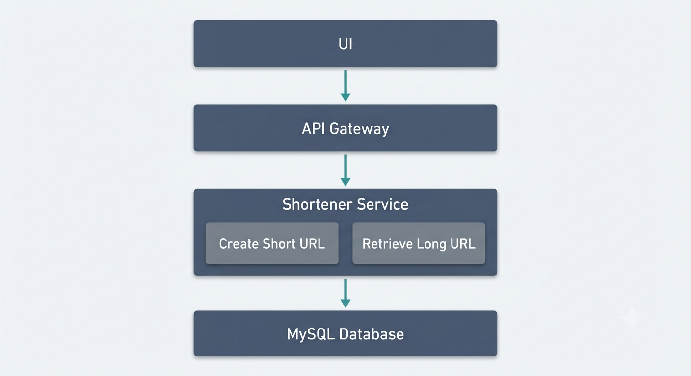

# SnipURL

A URL shortening service split into two independent operations: creating short URLs and retrieving/redirecting to long URLs.

---

## Architecture

```
UI → API Gateway → Shortener Service → MySQL Database
```



The API Gateway routes requests based on HTTP method + path (not custom logic):
- `POST /shorten` → Create Short URL service
- `GET /:shortCode` → Retrieve Long URL service

Both are implemented as separate route handlers within a single codebase — not separate deployed services. They share the same database and load pattern, so there's no scaling reason to split them into independent processes at this stage.

---

## Functional Requirements

1. **Create Short URL** — given a long URL, return a unique short URL.
2. **Retrieve Long URL** — given a short URL, redirect (302) to the original long URL.

**Why 302, not 301:** a 301 (permanent redirect) gets cached by the browser, so future clicks never hit the server again — losing analytics and the ability to change the mapping. 302 (temporary) forces every click back through the server.

---

## Non-Functional Requirements

- **High availability** — the service should always be reachable.
- **Low latency** — redirects in particular must resolve fast, since this is the hottest, most frequent path.

---

## Capacity Estimation

**Requests per year**, given `x` = requests per minute:

```
y = x × 60 (min/hr) × 24 (hr/day) × 365 (day/yr)
y = x × 525,600
```

This gives *average* QPS. Real traffic isn't evenly distributed — it spikes (e.g. a viral link) — so systems are designed for **peak QPS**, commonly estimated as:

```
peak QPS ≈ average QPS × 3   (heuristic, not a fixed rule)
```

**Read-heavy system:** redirects (reads) typically outnumber URL creation (writes) by roughly 100:1. This single fact drives the caching strategy — the read path (redirects) is where latency optimization matters most.

---

## Short Code Design

**Character set:** lowercase `a-z` (26) + uppercase `A-Z` (26) + digits `0-9` (10) = **62 characters** (base62).

**Why base62:** URL-safe, compact, and case-sensitive — maximizes unique combinations per character compared to using digits alone or a case-insensitive alphabet.

**Keyspace formula:** `total unique codes = 62^n`

| Length (n) | Total unique codes |
|---|---|
| 4 | ~14.7 million |
| 5 | ~916 million |
| 6 | ~56.8 billion |
| **7** | **~3.52 trillion** |

**Chosen length: n = 7** → `62^7 = 3,521,614,606,208` unique codes. This gives enormous headroom over realistic project-scale traffic (e.g. even 100M URLs created would use ~0.003% of the keyspace), so the system never needs to migrate to longer codes later.

**Generation approach: Base62-encoded auto-increment counter.**

| Approach | Trade-off |
|---|---|
| Base62 counter (chosen) | Guaranteed unique, no collision checks needed. Codes are sequential/guessable, but this is solved separately (rate-limiting), not by changing the algorithm. |
| Random string + collision check | Not guessable, but requires an extra DB read per write to check for collisions. |
| Hash + truncate | Deterministic, but truncated hashes still collide at scale — still needs a collision check. |

With a counter-based approach, code length grows naturally as the counter increases (no need to pad or fix `n` upfront) — unlike random generation, which requires fixing `n` in advance.

---

## Database Schema (MySQL)

```sql
CREATE TABLE urls (
    id BIGINT AUTO_INCREMENT PRIMARY KEY,
    short_code VARCHAR(10) NOT NULL,
    long_url TEXT NOT NULL,
    created_at TIMESTAMP DEFAULT CURRENT_TIMESTAMP,
    expires_at TIMESTAMP NULL,
    UNIQUE KEY idx_short_code (short_code)
);
```

- `id` (BIGINT, not INT) — source for base62 encoding; BIGINT avoids the ~2.1 billion ceiling of INT.
- `short_code` — the encoded value, stored and indexed separately from `id` so redirects don't need to re-encode on every read.
- **Unique index on `short_code`** — without it, every redirect is a full table scan (O(n)); with it, lookup is O(log n). This is what makes the "low latency" non-functional requirement achievable at scale.
- `long_url` as TEXT — avoids truncation on unusually long URLs (query params, tracking strings).
- `expires_at` — nullable, added upfront to avoid a future migration if link expiry is added later.

---

## Edge Cases Handled

- **Duplicate short codes:** prevented at the database level via the unique index on `short_code` — not left to application-level checking.
- **Permanent vs temporary redirect caching:** solved by choosing 302 over 301, so the server retains control over every redirect instead of the browser bypassing it after the first visit.
- **Keyspace exhaustion:** avoided by choosing `n = 7`, giving ~3.5 trillion codes — far beyond realistic scale for this project.
- **Counter contention under concurrent writes:** identified as a future bottleneck (multiple app instances competing for the same auto-increment counter), addressed in the scaling path below rather than built now, since a single instance has no contention to solve.

